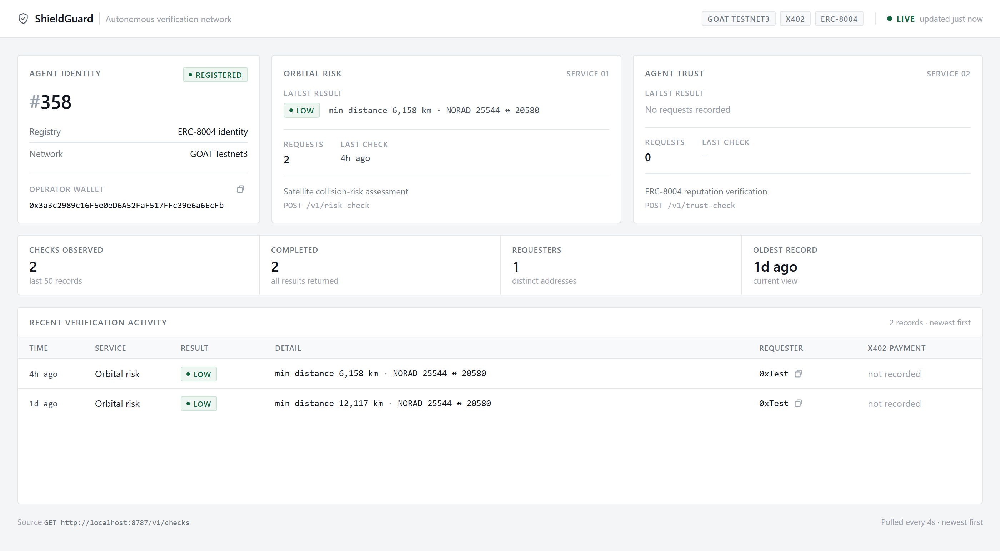

<p align="center">
  
</p>

<h1 align="center">ShieldGuard</h1>

<p align="center">
  Autonomous agent selling two machine-to-machine services over <b>x402</b> micropayments:
  <b>orbital collision-risk assessment</b> and <b>ERC-8004 agent trust verification</b>.
  Built for GOAT Network Builder Grant.
</p>

<p align="center">
  
  
  
  
</p>



## What it does

ShieldGuard runs as a paid service on GOAT Network. Other agents call it over HTTP, each request is
metered by an x402 payment gate, and the outcome is written to a Postgres ledger that the console
polls. Two services, one payment rail:

| Service | Endpoint | Question it answers | Result fields |
| --- | --- | --- | --- |
| **Orbital risk** | `POST /v1/risk-check` | How close do these two satellites come over the next window? | `riskLevel`, `minDistanceKm`, `noradIdA`, `noradIdB` |
| **Agent trust** | `POST /v1/trust-check` | Is this agent registered under ERC-8004, and what is its reputation? | `trustLevel`, `reputationScore`, `registered` |

Risk levels are derived from minimum separation: `critical` < 1 km, `high` < 5 km, `moderate` < 25 km,
`low` ≥ 25 km.

### How a check flows

```
calling agent ──▶ POST /v1/risk-check | /v1/trust-check
                    │
                    ├─ x402 gate         price + pay-to advertised; X-PAYMENT verified & settled
                    ├─ insertCheck()     ledger row written as `pending`
                    ├─ service           Celestrak TLEs + SGP4 (risk) │ ERC-8004 registries (trust)
                    └─ completeCheck()   result_payload stored, status → `completed`
                    ▼
             GET /v1/checks ──▶ console, polled every 4s
```

## Agent identity

| | |
| --- | --- |
| Agent | **#358** |
| Identity | ERC-8004 registered |
| Network | GOAT Testnet3 |
| Operator wallet | `0x3a3c2989c16F5e0eD6A52FaF517FFc39e6a6EcFb` |

## Quickstart

```bash
npm install
cp .env.example .env          # RPC URL, agent key, registry addresses, DATABASE_URL
createdb shieldguard
psql "$DATABASE_URL" -f db/schema.sql
npm run dev                   # API on :8787
```

Then start the console in a second terminal:

```bash
npm --prefix frontend install
npm --prefix frontend run dev
```

## API

| Method | Route | Notes |
| --- | --- | --- |
| `GET` | `/health` | `{ "status": "ok" }` |
| `GET` | `/v1/checks` | `{ checks: CheckRow[] }` — newest first, limit 50 |
| `POST` | `/v1/risk-check` | `{ requesterAddr, noradIdA, noradIdB, windowMinutes? }` → `{ checkId, result }` |
| `POST` | `/v1/trust-check` | `{ requesterAddr, agentAddress }` → `{ checkId, result }` |

```ts
type CheckRow = {
  id: string;
  requester_addr: string;
  check_type: "risk" | "trust";
  result_payload: object;
  payment_tx_hash: string | null;
  status: string;      // pending | paid | completed | failed
  created_at: string;
};
```

## Console

`frontend/` is a React + TypeScript console (one runtime dependency: React) that polls
`GET /v1/checks` every 4 seconds and renders only data the backend actually returns — no mock
metrics, no fabricated transactions. It surfaces agent identity, per-service status, verification
volume, and a table of every check with requester and x402 payment hash, plus designed live,
offline, empty and loading states.

## Build status

Kept deliberately honest — this is where the project actually stands:

| Piece | State |
| --- | --- |
| Orbital risk assessment | **Working.** Celestrak TLEs + SGP4, minimum separation sampled over a 24 h window. A coarse proximity screen, not a covariance-based conjunction assessment. |
| Postgres ledger + `GET /v1/checks` | **Working.** |
| ERC-8004 trust verification | **Working against placeholder ABI fragments** — awaiting confirmed registry addresses and real ABI from GOAT DevRel. |
| x402 payment gate | **Stub.** Advertises price and pay-to headers, but requests currently pass through unpaid. Must be replaced before any reviewer demo. |
| Verification console | **Working**, polls live backend data. |
| Agent registration script | Written (`src/scripts/registerAgent.ts`); not yet run against the live registry. |

## Repository layout

```
src/                 Hono API, risk + trust services, x402 gate, Postgres access
db/schema.sql        Postgres schema: checks, tle_cache, agent_trust
frontend/            React + TypeScript verification console
docs/                console screenshot, open questions for GOAT Network DevRel
ARCHITECTURE.md      component breakdown and integration points
BUILD_GUIDE.md       build order, prerequisites and checklist
```

## Documentation

- [ARCHITECTURE.md](ARCHITECTURE.md) — components, AgentKit integration, identity and payments
- [BUILD_GUIDE.md](BUILD_GUIDE.md) — prerequisites and the build-order checklist
- [docs/open-questions.md](docs/open-questions.md) — items to confirm with GOAT DevRel

## License

MIT — see [LICENSE](LICENSE).
